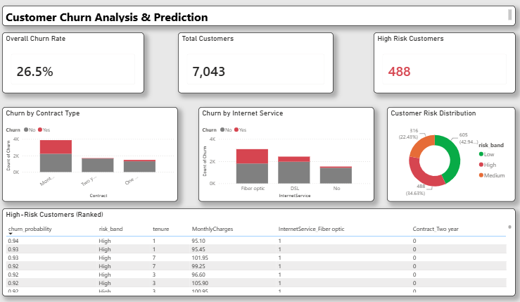

# Customer Churn Prediction

Predicting telecom customer churn using machine learning, with SQL-based analysis and a Power BI dashboard for business stakeholders.

## Problem

Customer churn directly impacts revenue, and acquiring a new customer typically costs more than retaining an existing one. This project identifies which customers are likely to churn and what drives that behaviour, so retention efforts can be targeted rather than broad.

## Dataset

IBM Telco Customer Churn — 7,043 customers, 21 features.
Target variable: `Churn` (26.5% churned, 73.5% retained).

`TotalCharges` was stored as text with blank-space entries for 11 new customers — invisible to `.isnull()` and silently coerced on conversion. Caught during type inspection and handled explicitly.

## Key Findings

| Finding | Evidence |
|---|---|
| Contract length is the strongest churn signal | Month-to-month customers churn at 42.71% vs 2.85% for two-year contracts — a 15x difference |
| Churn concentrates in the first year | 47.68% churn rate in months 0-12, dropping to 9.51% after 49 months |
| Fiber optic customers churn disproportionately | 41.89% vs 19.00% for DSL and 7.43% for no internet service |
| Higher monthly charges correlate with churn | Churned customers averaged $74.44/month vs $61.31 for retained |
| Support add-ons reduce churn | OnlineSecurity and TechSupport both showed strong negative coefficients |

Findings were validated two ways — visual EDA in Python and independent SQL aggregate queries — with consistent results.

## Modelling

Four models were compared on the churn class specifically, since overall accuracy is misleading on imbalanced data. Ordered by recall.

| Model | Precision | Recall | F1 | Accuracy |
|---|---|---|---|---|
| **Logistic Regression (balanced)** | 0.50 | **0.79** | 0.62 | 74% |
| XGBoost (scale_pos_weight=2.8) | 0.52 | 0.64 | 0.58 | 75% |
| Logistic Regression (baseline) | 0.65 | 0.56 | 0.60 | 80% |
| Random Forest (balanced) | 0.64 | 0.49 | 0.55 | 79% |

**Selected model:** balanced Logistic Regression. Despite lower headline accuracy, it catches 79% of actual churners versus 64% for XGBoost and 49% for Random Forest. In a churn context, a missed churner costs a lost customer while a false alarm costs a retention offer — so recall is prioritised. At 0.79 recall the model misses 79 of 374 churners; XGBoost misses 133.

**Notable result:** both tree ensembles underperformed the linear model on recall despite explicit imbalance handling, and they underperform in a consistent order. Logistic Regression fits a single decision boundary, so class weighting shifts it directly and fully. Random Forest applies the weight inside each of 100 trees but resolves by majority vote, which pulls predictions back toward the majority class. XGBoost sits between the two — sequential boosting propagates the weight more effectively than independent voting, but less directly than a single boundary. The recall ordering follows the mechanism: single boundary (0.79), sequential ensemble (0.64), voting ensemble (0.49). More model complexity did not translate into better minority-class detection here.

## Feature Importance

Strongest retention driver: two-year contracts (coefficient -1.42), nearly 3x the magnitude of the top churn driver.
Strongest churn drivers: fiber optic internet (+0.46) and electronic check payment (+0.41).

Electronic check as a churn signal did not surface during visual EDA — the model identified it independently.

**Cross-model agreement.** XGBoost's feature importances independently rank the same top two: Contract_Two year (0.338) and InternetService_Fiber optic (0.187), with Contract_One year third (0.143). Two unrelated algorithm families converging on the same dominant signals is stronger evidence than either alone.

The two measures are not directly comparable, however. Logistic Regression coefficients are signed and indicate direction; XGBoost importances are unsigned and only indicate how heavily a feature was used for splitting. Contract_Two year ranking first in XGBoost says the model relied on it, not that it reduces churn — that direction is known only from the linear model.

One divergence: electronic check payment ranks 2nd among churn drivers in Logistic Regression but 8th in XGBoost (0.016). Tree models can distribute a signal across correlated features — payment method correlates with contract type and tenure — while a linear additive model assigns it directly.

## Dashboard



Customers are segmented into Low (<0.3), Medium (0.3–0.6), and High (>0.6) risk bands, with a ranked table of high-risk customers for retention teams to action. 488 customers are flagged High against 374 actual churners in the test set — the model over-flags by design, consistent with the recall-first threshold choice above.

## Project Structure

```
churn_prediction/
├── data/
│   ├── WA_Fn-UseC_-Telco-Customer-Churn.csv
│   └── churn_predictions.csv
├── images/
│   └── dashboard.png
├── notebooks/
│   ├── 1_eda.ipynb
│   └── 2_modeling.ipynb
├── sql/
│   └── exploratory_queries.sql
├── churn_dashboard.pbix
├── .gitignore
└── README.md
```

## Tools

Python (pandas, scikit-learn, xgboost, seaborn, matplotlib) · MySQL · Power BI